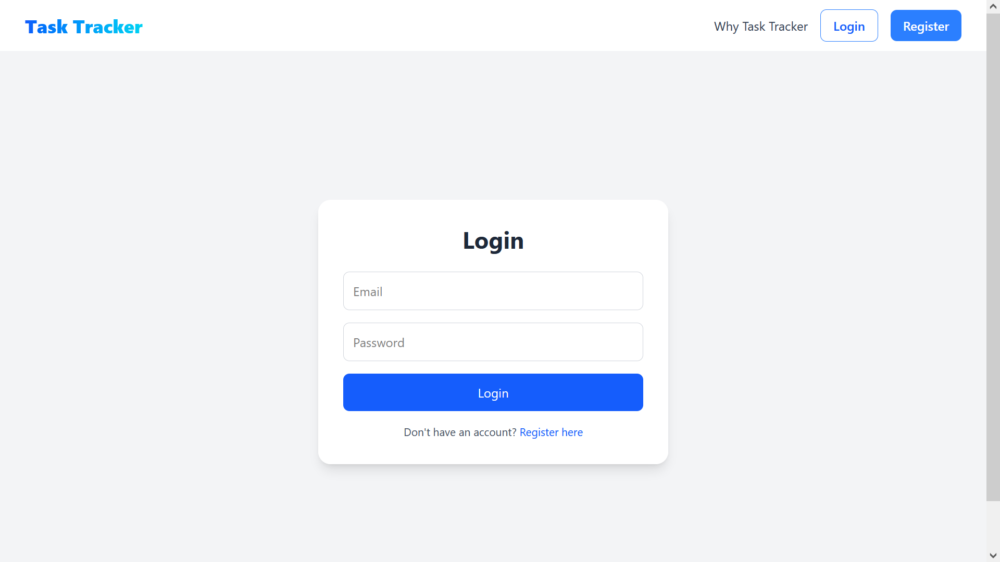
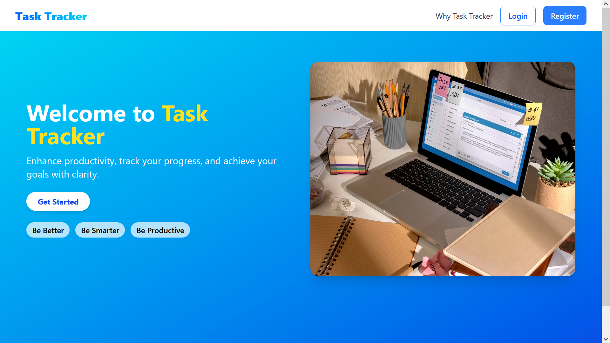
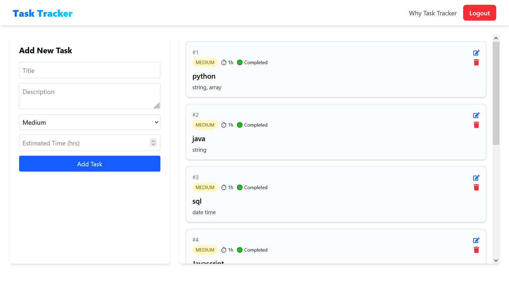

# ✅ Smart Task Tracker — Full Stack Project

A full-stack, modern, and responsive Task Management Web App to efficiently manage your daily goals. Built with **React + Vite + Tailwind CSS + Material UI** on the frontend and **Spring Boot + MySQL + JWT + Hibernate** on the backend. This project supports role-based access control and a dynamic UI dashboard to boost your productivity.

---

## 🔥 Features

- 🔐 JWT-based Login & Registration
- 🎯 Role-based access: User/Admin
- 📝 Create, edit, delete, and view tasks
- 📌 Task metadata: priority, estimated time, due date, and status
- 📊 Responsive dashboard UI with Material UI & Tailwind
- 🗃️ REST APIs secured with Spring Security
- 📅 Roadmap for calendar view, analytics, and real-time updates

---

## 🛠 Tech Stack

### 👨‍💻 Frontend
- React 18+
- Vite
- Tailwind CSS
- Material UI (MUI)
- React Router DOM
- Axios

### 🔙 Backend
- Java 17+
- Spring Boot 3.5.3
- Spring Security 6
- Hibernate (JPA)
- MySQL
- JWT (Token-Based Authentication)

---

## 🖼️ UI Screenshots

> 📁 Place these images in a `screenshots/` folder in your root directory.

### 🔐 Login Page


### 🗂️ Dashboard


### ➕ Add Task


---

## 🚀 Getting Started

## Clone the Repositories

```bash
# Frontend
git clone https://github.com/As377507/task-tracker-frontend.git
cd task-tracker-frontend
npm install
npm run dev

# Backend
git clone https://github.com/As377507/task-tracker-backend.git
cd task-tracker-backend
./mvnw spring-boot:run

```bash

---

## 📦 Folder Structure

Smart-Task-Tracker
├── task-tracker-frontend
│ ├── public/
│ ├── src/
│ │ ├── assets/
│ │ ├── components/
│ │ ├── pages/
│ │ ├── App.jsx
│ │ ├── main.jsx
│ │ ├── index.css
│ └── tailwind.config.js
│
├── task-tracker-backend
│ ├── src/
│ │ ├── main/
│ │ │ ├── java/
│ │ │ │ └── com/example/tasktracker/
│ │ │ │ ├── controller/
│ │ │ │ ├── model/
│ │ │ │ ├── repository/
│ │ │ │ ├── service/
│ │ │ │ ├── security/
│ │ │ │ └── TaskTrackerApplication.java
│ │ │ └── resources/
│ │ │ └── application.properties
└── README.md

---

## 🎨 Tailwind CSS Setup (Frontend)

If Tailwind CSS is not already configured, follow these steps:

### ✅ Step 1: Install Tailwind

```bash
 https://tailwindcss.com/docs/installation/using-vite follow that document line by line for perfect setup

```bash

---

## ⚙️ Backend Configuration

In src/main/resources/application.properties, add the following:

spring.datasource.url=jdbc:mysql://localhost:3306/task_db
spring.datasource.username=root
spring.datasource.password=yourpassword
spring.jpa.hibernate.ddl-auto=update
jwt.secret=yourSecretKey

---

## 🚀 Running the App
## 👉 Backend (Spring Boot)

```bash
cd task-tracker-backend
./mvnw spring-boot:run

```bash

## 👉 Frontend (React + Vite)

```bash

cd task-tracker-frontend
npm install
npm run dev

```bash

---

## 👤 Author

Made with ❤️ by Akash Sen

    🔗 LinkedIn : link

    📧 Email: asen05897@gmail.com

---

## 📝 License

This project is licensed under the MIT License.

